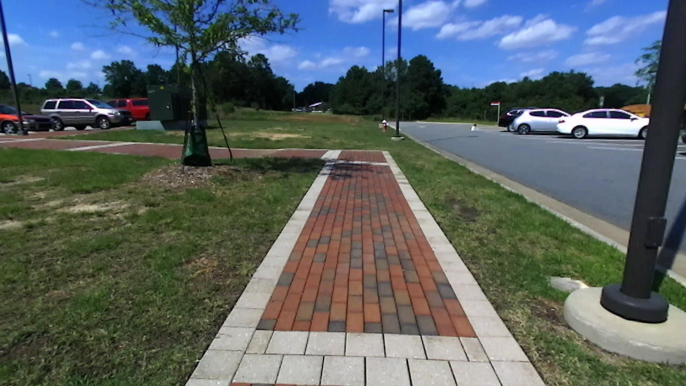
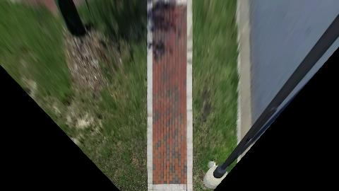
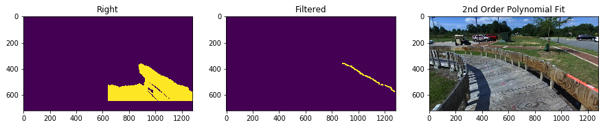

## Detecting the Railings of a Track Using a Stereo Vision Camera

Please see python notebook for commented code

### Video of Second Order Polyfit of Railing

### Video of Linear Fit of Railing

### Video Showing points detected accross multiple Frames to try to get more accurate polyfit

### Example of Depth Image Used for Detecting Rails

Original Image            |  Depth Image
:-------------------------:|:-------------------------:
  |  

### Perspective transform
The perspective trasform is used to convert from pixel coordinates to real world coordinates.
Although the ZED Sdk can provide a 3D point cloud with real wold coordinates it will be interesting to compare the accuracy between the two methods.

Once the railing is detected its distance from the center of the vehicle can be determined using the perspective transform.

Perspective Transform obtained using opencv's getPerspectiveTransform function

Calibration Image          |  Birds Eye View Pespective Transform
:-------------------------:|:-------------------------:
  |  

### Read a small subset of images for fine tuning the filtering parameters

### The image Below shows how the filtering is done to detect the railing.
First the depth image is read in and the left of the image is masked as well as a small strip on the bottom. The bottom had to be cropped out due to the image being distorted at this close range. 

Then all pixel values below a certain value (i.e too far away to be the railing) are masked out. The remaining pixels are all set to a single max value.

Each row of the image matrix is scanned from right to left to find the first non zero pixel. These pixel points are ultimately used in the polyfit. 

The pixels are converted to real world coordinates using a perspective transform. The perspective transform is determined by a calibrated image. The polynomial fit is then done on the transformed pixels. This allows for the polynomial fit to give us a radius of curvature that is useful for navigation. Also the approximate distance from the track is easily obtained.

Finally the polyfit function is tranformed back into pixel coordinates and displayed on the image.

 
